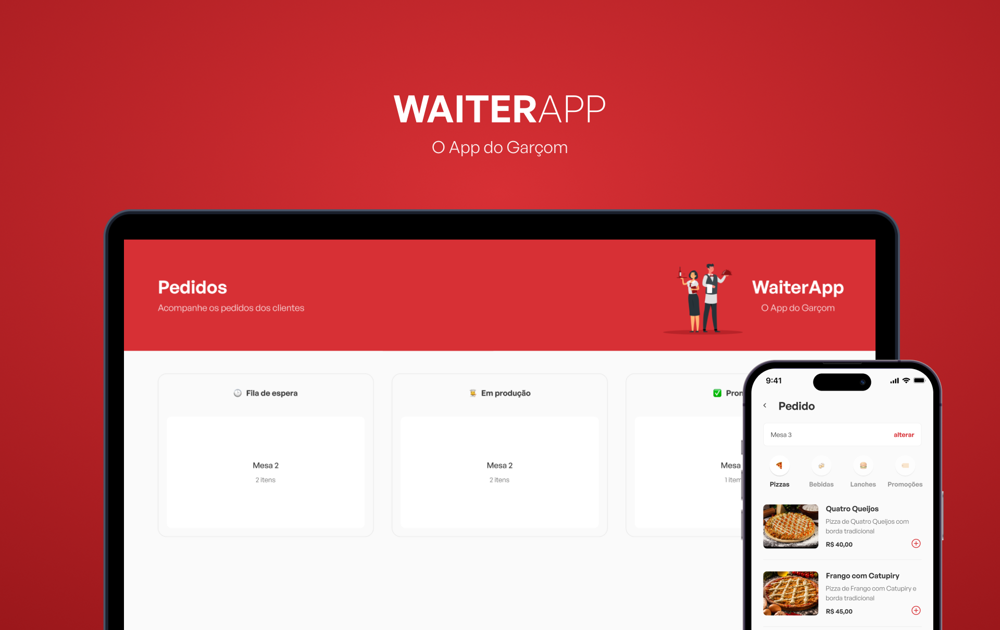

<h1 align="center">WaiterAPP - O app do garçom</h1>


<p align="center">O aplicativo ideal para organização, retirada e gerenciamento de pedidos. Tudo isso com integração entre quem pede e quem prepara. 😉</p>



<h2 align='center'>Conteúdos</h2>

<p align="center">
 <a href="#como-instalar">Como instalar</a> •
 <a href="#objetivo">Objetivo</a> •
 <a href="#tecnologias">Tecnologias</a> • 
 <a href="#desenvolvedor">Desenvolvedor</a>
</p>

## Como instalar

* Primeiro clone o projeto para sua máquina seguindo a instrução abaixo:

```
1. git clone https://github.com/ViniciusSLisboa/waiter-app.git
```

### Backend (api)

* Para instalar o projeto siga as instruções abaixo:

```
1. cd api
``` 
* Instale as dependências e inicie o servidor:

```
2. yarn install
3. yarn dev
``` 
ou

```
2. npm install
3. npm run dev
``` 

### Frontend (react)

* Para instalar o projeto siga as instruções abaixo:

```
1. cd fe
``` 
* Instale as dependências e inicie o projeto web:

```
2. yarn install
3. yarn dev
``` 
ou

```
2. npm install
3. npm run dev
``` 

### Mobile (react native - expo)

* Para instalar o projeto siga as instruções abaixo:

```
1. cd app
```
* Instale as dependências e inicie o app:

```
2. yarn install
3. yarn start
```
ou

```
2. npm install
3. npm start
```

## Objetivo

Oferecer uma aplicação que consiga contribuir para fluidez da comunição entre o garçom e a cozinha, tornando o processo ágil, prático e simples. O cliente pede e instantâneamente o pedido é enviado para a cozinha. Sem atraso e sem demora. 
Com um app mobile desenvolvido em React Native, o garçom tem autonomia de ir as mesas e tirar os pedidos sem medo de errar algum deles e sem precisar retornar a cozinha para levar o pedido. Já na cozinha o app web desenvolvido em React mostra em tempo real os pedidos que são enviados, podendo cancelá-los e finalizá-los com facilidade.


## Tecnologias

- [Node.js](https://nodejs.org/pt-br/)
- [TypeScript](https://www.typescriptlang.org/)
- [React](https://reactjs.org/)
- [React Native](https://reactnative.dev/)
- [Docker](https://www.docker.com/)
- [MongoDB](https://www.mongodb.com/)

## Desenvolvedor

Desenvolvido por [Vinícius Soares Lisboa](https://github.com/ViniciusSLisboa). 👨‍💻